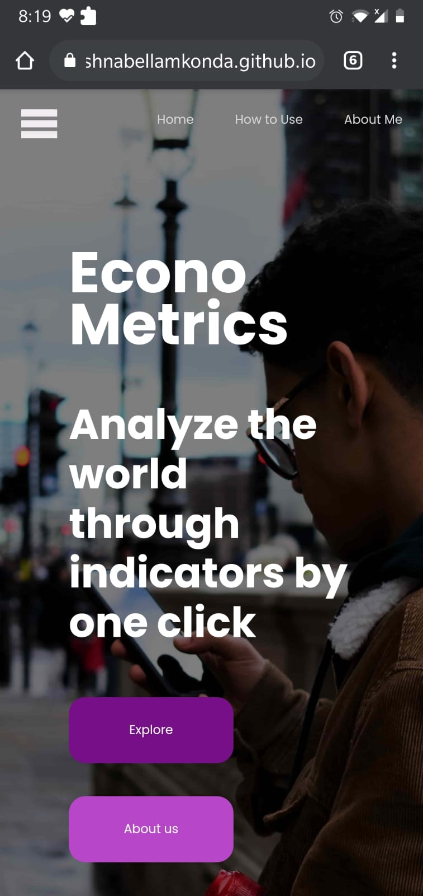

# econo-metrics 

### Description 
*This is a web application that provides up-to-date information about economies around the world. Using the world bank api to access information, this application makes understanding a country's economic situation very easy.*

### Website 
**Check out the website here(https://krishnabellamkonda.github.io/econo-metrics/)**

### Table of Contents

### Setup
* Clone the repository and enter into it 
```
$cd econo_metrics
```
* You can then start the development server by running 
```
$npm start
```


### Web application 


### Functionality 
This application uses the World Bank API to fetch latest data on current day economies around the world. It displays this data in an interactive fashion through the help of different sections. You can visualize data belonging to individual country or a region using this application. 

### Sections
* 1) World at a Glance - This section shows current situation in different regions of the world. 
* 2) Popular Section - This section shows top 10 countries listed in a certain 'popular' indicator.
* 3) Country Indepth - This section shows social, macro and trade situation of a certain country in a certain year. 

### Technology 
1) JavaScript 
   - ReactJS 
   - ChartJS 
   - World Bank API 
2) Python (for Data Exploration)
   - pandas
   - numpy 
   - matplotlib 


### App in Action
* Coverpage

* World at a Glance

* Popular Section

* Country Indepth

* Country Indepth (cont)

* About Me


This project was bootstrapped with [Create React App](https://github.com/facebook/create-react-app).

## Available Scripts

* Start development server - `npm start` 
Runs the app in the development mode.\
Open [http://localhost:3000](http://localhost:3000) to view it in the browser.

The page will reload if you make edits.\
You will also see any lint errors in the console.

### Sources
1) ReactJS - (https://reactjs.org/)
2) World Bank API(https://datahelpdesk.worldbank.org/knowledgebase/articles/889392-about-the-indicators-api-documentation) 
3) EconoMetrics website link (https://krishnabellamkonda.github.io/econo-metrics/#about-us)

